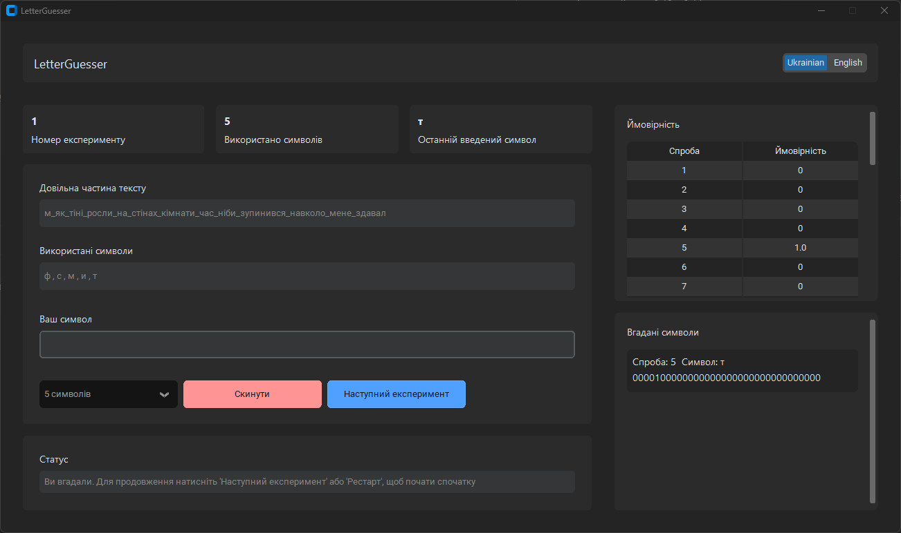

[](https://stand-with-ukraine.pp.ua)

# LetterGuesser

LetterGuesser — is a program designed to replace the original CoolPinkProgram used in the
cryptography course. It is based on [CustomTkinter](https://github.com/TomSchimansky/CustomTkinter) and supports
localisation (Ukrainian and English), adaptation to the system theme (light or dark). The application can be run as
Python script, or as an .exe file (installed via [PyInstaller](https://pyinstaller.org/en/stable/)).




---

## Installation

### Requirements

- python >=3.10, <3.14
- customtkinter (^5.2.2)
- ctktable (^1.1)
- babel (^2.16.0)

### Run as .exe

Checkout [release](https://github.com/looomenn/LetterGuesser/releases) page for latest builds

### Install as module

Install the module with pip

```bash
pip install letterguesser
```

Run the module

```bash
python -m letterguesser
```

### Installing as module (manually)

Create new env (for example, using Conda)

```bash
conda create --name letterguesser python=3.11
```

Activate new env

```bash
conda activate letterguesser
```

Clone this repo

```bash
git clone https://github.com/looomenn/LetterGuesser.git
```

Change directory to the repo root

```bash
cd LetterGuesser
```

Install poetry (build base)

```bash
pip install poetry
```

Install all dependencies

```bash
poetry install
```

You can also install only dev dependencies (used for tests)

```bash
poetry install --only dev
```

At root level run pip to install as a module

```bash
pip install . --user
```

If there are only `.po` files (`assets/locales/`) use this to compile them into `.mo`

```bash 
pybabel compile --use-fuzzy -d  ./letterguesser/assets/locales
```

Run the module

```bash
python -m letterguesser
```